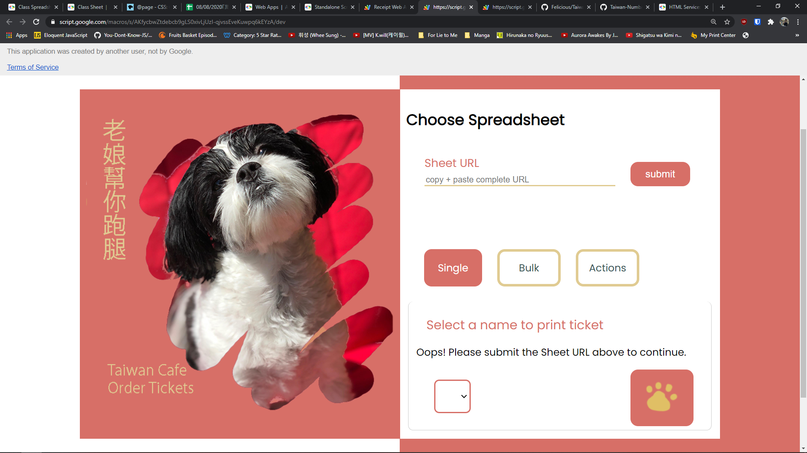
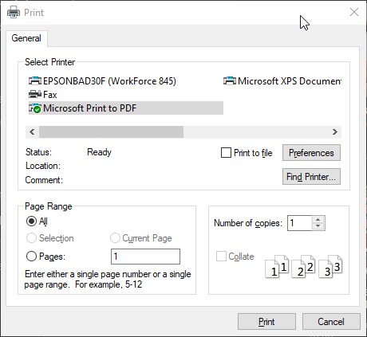
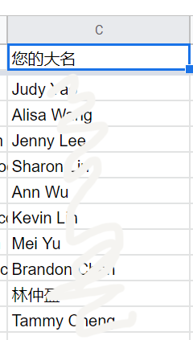
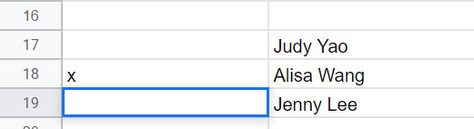

# Order Ticket

Written for my favorite restaurant, Taiwan Cafe, this project aims to reduce food order preparation time by automatically generating printable order tickets from customer Google Form submissions.

## Getting Started

In order to run the [Google Apps Script](https://script.google.com), a Google tool to automate and manage your Google apps, like Google Forms & Sheets, you will need to follow these instructions:

1. Open the Taiwan Cafe spreadsheet containing all the form responses
2. Find the latest update of my web app and open it.
3. Now you're here!
   
4. Go ahead and fill in the URL after copy and pasting it from the Google Sheet.
5. Once you click submit, scroll down to the "Single" tab at the bottom and you can now select the names of the people you'd like to make a receipt for! Just a note: only customers whose receipts have yet to printed will show up in the drop-down menu.
6. Once you've picked a name, press the button with the paw to generate the receipt!
7. It'll take you to the page the receipt is (even though it's not that cute rn)
8. To print, press Ctrl + P and select "Microsoft Print to PDF"
   
9. After you're done printing, press back **once** and you'll be on the same page after submitting the url of the Google Sheets. Reload the page (Ctrl + R) to update it, and you should be able to select more customer names!

### Things to know (as the user)

Things the web app will do or change that you, the user, should be aware of:

1. Will add 2 new columns for storage purposes on your Spreadsheet.
2. The names of the customers are determined by column numbers, so it's **IMPERATIVE** that the names of the customers are always in the the fifth column, E, after my 2 columns are added. Therefore I expect the name to be in the third column (C)before the web app changes anything.
   
3. The app reads column names and extracts the name of the menu item and price. However, it's kinda dumb and extracts the values based on order. Therefore, you must ensure that the order of those items are always price, name, [details or descriptions]. Example: "$11 Taiwan sausage [very yummy]".
4. After the receipt has been made, the app will record an "x" in the first column of the Spreadsheet. If you'd like to print that customer's receipt ticket again, delete the x and reload the web app
5. Any additional comments customers left on the form are the last column of the spreadsheet

## Behavior

1. Create a UI for user to select un-processed receipts for a print job
2. Customer Google Form Submit runs ticket generating script
3. Google Apps Script
   1. Gather user input
      - Google Forms
      - [Google Sheets](https://developers.google.com/apps-script/guides/sheets#reading_data)
4. My Receipt App
   1. My web app takes in the URL of your Google Sheet (which contains the customer form submissions)
   2. When you (the user) presses the submit button, an HTTP request is sent to the web application which allows my server-side code access to the (client-side) customer data from your Google Sheets.
   3. The server returns a list of names you can select on the website to choose who to make a receipt for.
      - This time, info is sent from server to client
   4. Select the customer and click the paw print (another submit button)
      - Another HTTP request is sent to the server
   5. Create printout based on [HTML template](https://developers.google.com/apps-script/guides/html/templates "Google HTML services doc") from the info sent from the client
      - Server side logic:
        1. Script will parse + save Customer order + info as an object
        2. Object passed to HTML template. [See example here](https://developers.google.com/apps-script/guides/html/templates#calling_apps_script_functions_from_a_template)
   6. Send completed ticket to client to print
   7. Mark entry on Google Sheet as checked for "Sent to print"

### Potential Features

Let me know if these things would be helpful:

1. Invite customers to [Google Calendar event](https://developers.google.com/apps-script/quickstart/forms "The useful how-to") to remind them to pick up the food when the date arrives
   - This would be cool to implement, but it would require Kevin-叔叔 to indicate the pick-up time somewhere
2. Make a separate checklist for customers with Venmo orders to help Stephanie keep track of the people paying with Venmo
3. Calculate customer totals

## Assumptions about User Inputs

In order for this script to work, it assumes that the user will input data into the form a specific way. If the user fails to do so, _script may break_.

## Testing

## FAQ

1. Total cost column in Spreadsheet displaying date
   - Fix: mannually click on the column in Google Sheet
   - select the "More formats" button on the toolbar at the top of the screen (the icon is `123` with a triangle pointing down)
   - select "Number"
   - Make sure all the rows that need to be converted from Date -> Number are highlighted
2. Selects unmarked cells to print; Make sure you've cleared and CLICKED OUT OF a cell, otherwise Sheets would think you're still editing a cell and think that the cell isn't empty
   - In the image below, for example, Jenny Lee's print box would NOT be considered empty yet since the user had not yet clicked away from the cell.
   - 
3.

## Author

Felicia Kuan

## Acknowledgments

- Derrick Lee, who gave tremendously useful advice on coding best practices and actively contributed to the writing, debugging, and planning of code.
