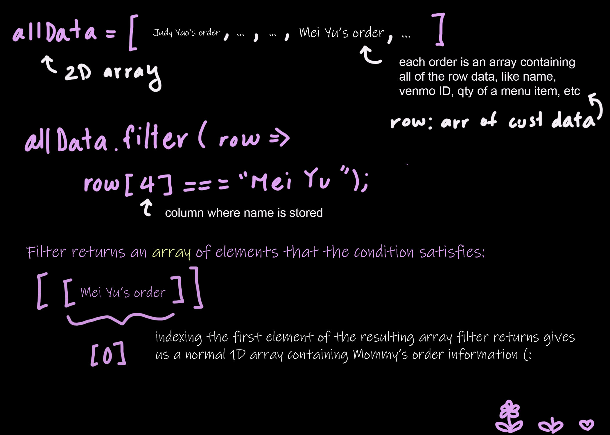
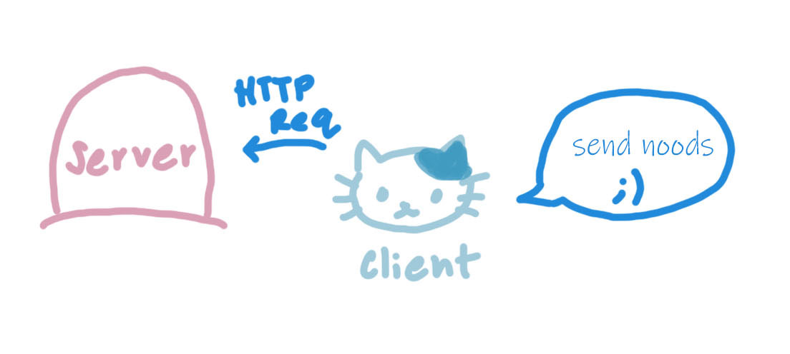
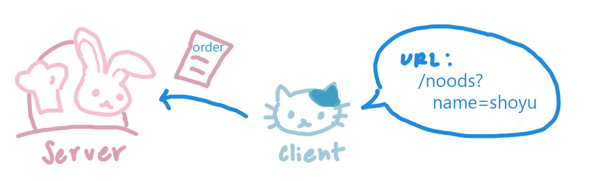
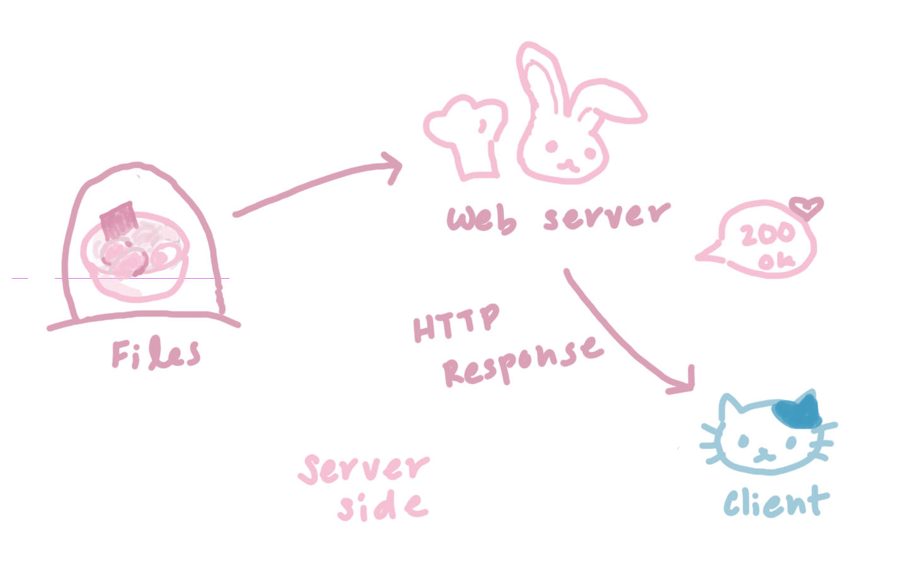
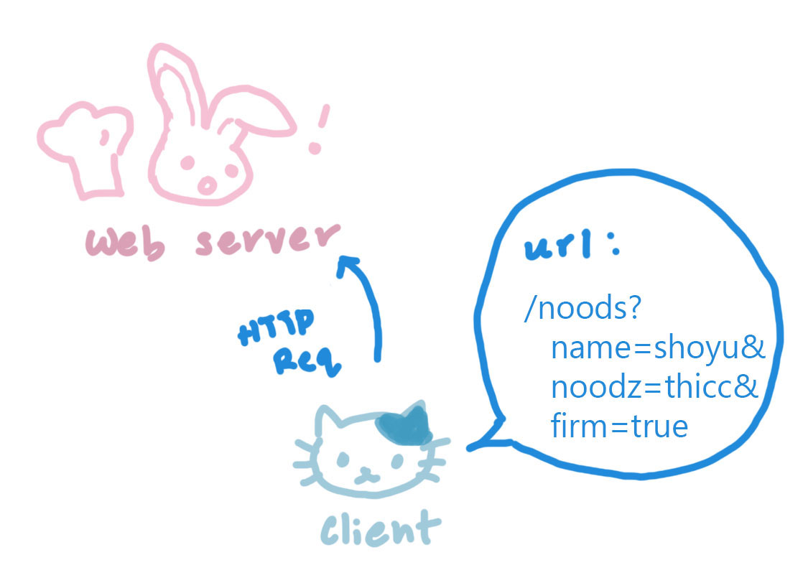
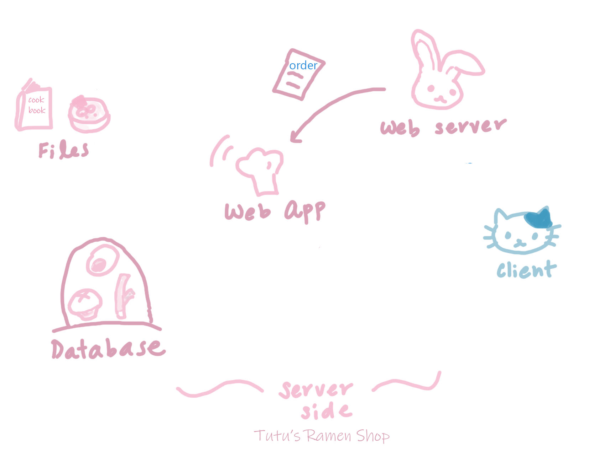
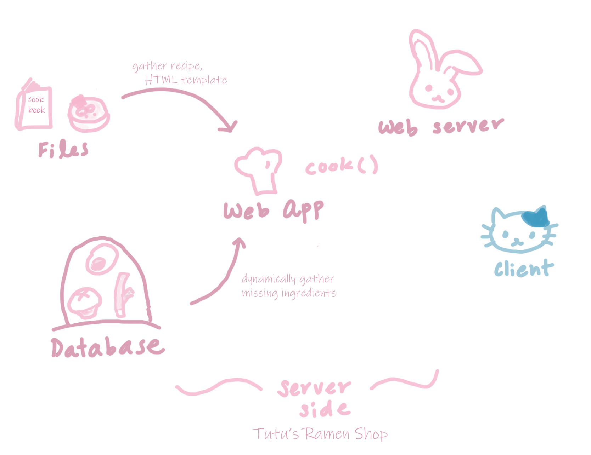
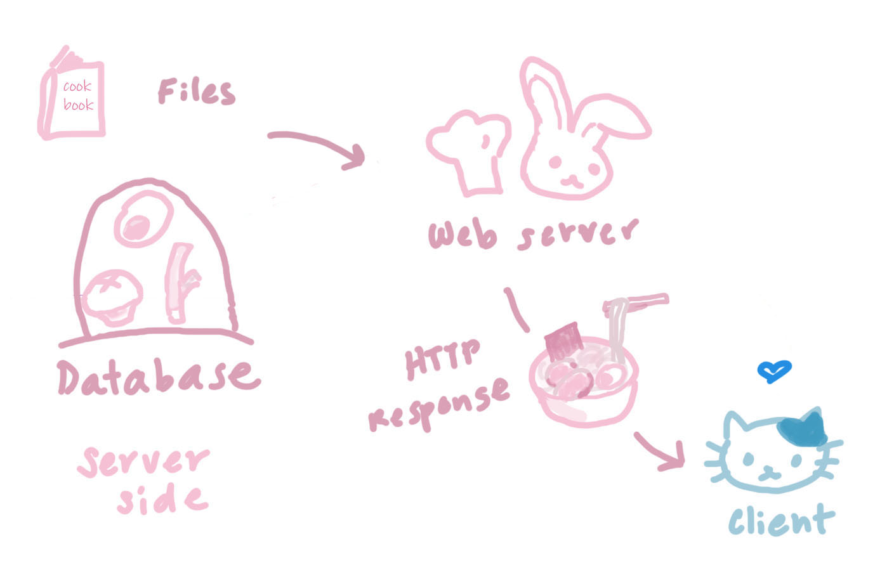

## Useful Functions

### Google Sheets Built-ins

1. sheet.getDataRange().getValues() -> get all the cols and rows from the sheet.
   sheet is a variable assigned the value of the the Spreadsheet
2. sheet.getRange(parameter) -> getting a specific column. Use "A1:A" to get the entire column of A, starting from row 1
3. Write to a cell

```
var range = SpreadsheetApp.getActiveSpreadsheet().getRange("B5");
range.setValue("TEXT");
```

4.

## Retrieve Rows from Spreadsheet

Easiest way to go through rows of data, from [StackOverflow](https://stackoverflow.com/questions/10518084/retrieve-rows-from-spreadsheet-data-using-google-app-script)

`var data = SpreadsheetApp.getActiveSheet().getDataRange().getValues();`

Then use a loop

`for (i in data) {`

### Destructuring

Learning coding from Meow~ The following are lines of code Meowmeow wrote for me, and he used the concept of destructuring a 2D array to make the array a little more read-able.

`const [columnNames, ...data] = getGoogleSheetInfo();`

The concept of [head, ... tail], declaring an array in this fashion names the first index (in our ex, it's an arr of all column names) of the large array is named columnNames, and the rest of the arr elements are left alone.

`const { start, end } = getItemColumnIndexes(menuItems);`

The function getItemColumnIndexes() returns an object with two properties, and the declaration on the left saves the values returned in the obj properties as two separate variables. This is essentially a short version of:

`const object = getItemColumnIndexes(menuItems); const start = object.start; const end = object.end;`

### Regular Expressions

Herein lie notes on the subject that are extremely useful to find patterns in words. To extract the price from the name and description of Chinese menu items, Derrick used [Regular Expressions](https://developer.mozilla.org/en-US/docs/Web/JavaScript/Guide/Regular_Expressions) to find the pattern of a dollar sign directly followed by a number (no space!) `$price`

- Regular expressions are particularly useful when using the method _match()_, which takes the string combination you want to find in a piece of text as input. The parameter is typically a regular expression. [More details here](https://developer.mozilla.org/en-US/docs/Web/JavaScript/Reference/Global_Objects/String/match)

  1. Captured groups that are unnamed are saved as an array (see how values are saved inside the arr [_match[]_](https://developer.mozilla.org/en-US/docs/Web/JavaScript/Guide/Regular_Expressions/Groups_and_Ranges))
  2. Refer to named capture groups using the call matches.groups.name
     1. matches is a var saving the value of the .match() call
        ex: `const matches = imageDescription.match(regexpSize);`
     2. name will be the name of the capture group
        ex: `(?<name>\w)`

- [Regular expression simulation](https://regex101.com/) so you can check if your hardly understandable string of characters like `\$(?<cost>\d+)` works as expected

_Concepts required to understand regex_
(Or rather, some concepts I need reminders of to remember them)

1. Backslash `\`, an _escape character_ so that I can use special characters or characters that might break a string
   - In uni, I used the command `\n` to make a new line, but if I actually wanted to write \n, not make a new line, I'd write `\\n`
2. Special characters that represent a wide range of characters:
   1. Any digit `\d`
   - If I wanted exactly 3 digits `\d\d\d` would match any 3 digit characters
   2. `\w` any letter or number, including underscore
   3. `\s` a white space character
   4. [See more](https://developer.mozilla.org/en-US/docs/Web/JavaScript/Guide/Regular_Expressions/Cheatsheet)
3. Dealing with more than single letters/ (called _quantifiers_)
   1. `+` indicates 1 or more
   2. `*` is 0 or more
   3. Characters in #1 & #2 are used after others. `\d+` means 1 or more digit.
   4. `?` means it's optional
   5. `^` negation of something.
4. Groups and ranges of characters
   1. After capturing a group of characters "x", save it into the variable "name": `(?<Name>x)`
      - Ex: `\$(?<cost>\d+)` saving a number immediately proceeding a dollar sign
   2. Ignore the following x `(?:x)`
      - An example of skipping the https/fps part and keeping the rest: `(?:https?|ftp)://([^/\r\n]+)(/[^\r\n]*)?`
      - Also a note about the above example, `\r\n` is the standard line-termination for text formats on the internet
5. Mistakes I've made
   1. I tried to "exclude" \$price and [description] from `$price name [description]` using (incorrectly):
      - `(?:\$\d+)` which excludes price, and
      - `(?:\[\])` which didn't even exclude the brackets [ ], not to mention what's inside the brackets
      - Typically, Derrick advises not to "exclude" expressions. Instead, group what you want to keep in [capture groups](https://javascript.info/regexp-groups), and try to write out the format of the expression (see #3 for more details)
   2. Incorrectly placed the `^` to capture "all characters except [" outside the brackets
      - Correct way: `[^\[]`
      - Wrong way: `^[\[]`
   3. Ignore the dollar sign by writing out the dollar sign, but only saving the dollar value in cost
      - `\$(?<cost>\d+)`

## Reading/Writing to Google Sheets

Basic things are to determine

1. which cells you'll write to
   - Use `sh.getRange(start, end)` for a row
2. Update them
   - A single cell, use
     `const cell = sheet.getRange(1,1); cell.setValue(2);`
   - Use `sh.updateValues(spreadsheetId, range, valueInputOption, _values)` for multiple rows and columns
   - [Documentation](https://github.com/gsuitedevs/apps-script-samples/blob/master/sheets/api/spreadsheet_snippets.gs)

# Why I can't use Document methods

What I've been working with until now has been Javascript on the browser side, while Apps Script runs on Google's servers, so I will have to be dealing with server-side Javascript for this project. Hurray.
The following are explanations from my love, Derricku!
Regular web pages in the browser, which is the only time where there's actually a document. Browsers load HTML, which then loads js. Compared to servers, they execute js without any HTML involved, which is why there isn't a document, or DOM.

This is why the HTML template doesn't know what a document is, because it's just strings within a server js script. Also, it's kind of an external thing compared to the apps script, you evaluate the HTML template from apps script, which is

server js -> evaluates template via inline scriplets -> HTML string

there isn't any HTML involved until the end, which isn't an actual document but rather a string.

vs the browser is

HTML string -> parsed and evaluated in browser -> JS is loaded and evaluated, with access to the DOM

HTML loads the JS as compared to apps script which is JS generating a HTML string

For an incredibly useful guide on HTML templating with Google Apps Script that I followed, please look at [Emily's github](https://github.com/emilyb7/HTML-templating-with-Google-Apps-Script)

## Understanding Emily's code

Her [src code](https://github.com/emilyb7/HTML-templating-with-Google-Apps-Script/blob/master/Code.gs) had a lot of idiomatic JS things that I didn't immediately understand; the source of much of the confusion was regarding the callback logic.

While I was heavily _referencing_ her code, I was puzzling over `getData()`, specifically why it was necessary to index the first array element `[0]` after filtering `allData()` to a single row.

```
function findRowByName(name) {
  const allData = sheet
    .getRange(2, 1, sheet.getLastRow(), sheet.getLastColumn())
    .getValues();

  return allData.filter(function(row) {
    return row[4] === name; // 4 is the col where the names are stored
  })[0]; // filter returns an arr of elements that satisfy the condition
}
```

The function returns a 1D array containing the row data from the Sheet that matches the `name` passed in as the parameter.

The confusion lies in the return value of `.filter()` and why the `[0]` is necessary.



The main clarifying explanation is that `.filter()` returns an _array_ of elements `[ [row data] ]` that satisfies the condition. However, the element, the row data, is an array. So we have an array within an array, which isn't ideal. To just get the inner array, we index it with `[0]`, which gives us the first and only element of the outer array.

# Middle of the Project Complete Overhaul

Originally, I approached this project like this:

1. User (Kevin-susu) runs my script
2. Script reads spreadsheet -> returns data
3. Take the data -> script generates html page from data -> returns html receipt
4. html -> script opens a page with the generated html
5. User downloads page

This was a script running on the server, where the script is run when the user runs the script through the spreadsheet menu.

Derrick explains that in step 3-4, once you have some html in your script, you can't just throw it at the user; the user has to explicitly open the page with the generated html. However, since you cannot simply pass the html to the user through data urls due to browswer security issues, there's no way to get the user to open the page.

Thus, the only working option is to have the user open a link to the scrip which is independent of the previous logic in steps 1-3.

The revised logical steps are:

1. User opens script web app [standalone scripts](https://developers.google.com/apps-script/guides/standalone)
2. script reads spreadsheet -> data
3. data -> script generates html page from data -> html
4. html -> served to user
5. user downloads page

Compared to the script running on the server before, this will be web app, which is run when the user loads the script url in their browser. The script then runs the logic on the server, and responds to the browser request with data.

click run -> script exec

vs

browser request -> script run -> script responds with data to browser

"So how you can think of it is like how a c++ program when you execute it, it runs the main() function. so when a user runs a script via the spreadsheet, it runs main(), but when a user runs the script via the web app, it runs doGet() instead.

they're independent from each other."

"you're writing a web app now, which means the function doGet(e) executed when the the browser sends a request to your script

so in order to run the function you send the app an http get request

which is just loading the script in your browser
doGet() is run on the server
I request a meowmeow pic, you doGet() which returns a meowmeow, and you respond with a pic
you're the server, I'm client
I just ask you for something, you do the thing, doGet(), and respond with the result

# falsey comparison

_Definition_: any empty/null value considered false like 0, null, undefined (From [Mozilla](https://developer.mozilla.org/en-US/docs/Glossary/Falsy))

Referring the bug above, the if statement is fundamentally incorrect because `if ([""] === "")` is comparing an array to a string, which is incorrect.

- Since the first element of the array [""] is the empty string, I need to do the following instead.

```
`if(data[0][i] === "")`
```

- Alternatively, Derrick recommends `if(!cell[i][0])` since if cell[i] is an empty array [], cell[i][0] would return undefined, not ""
  so just checking if it's falsey compares the following:
  - if the first element string is empty
  - if there is no first element since undefined is considered falsey
  - This is equivalent to explicit checks like: `if (cell[i][0] === undefined || cell[i][0] === "")`

# Server, Client-side

APIs of the REST category and webpages use URLs to send or receive information from a web app or server. My lovely Derrick illustrates this exchange in the following example:

> When a browser makes a request, a letter is sent to the server with information on it, maybe like a request for what I want.
>
> For example, I (browser) can send Felicia (server) a letter. The outside of the letter, represented by the URL parameters, contains basic information about the things I am requesting from the server like {"meowmeow":"mimi", "type":"video}

Before moving on, I'd like to clarify that this is an example of an HTTP request from the browser to server requesting a Mimi video. Derrick would then expect a Mimi video served to him from the server in the form of a webpage?

Continuing with the analogy Derrick provided earlier,

> After receiving the contents of the request, the server processes the request with the function doGet(e). The parameter **e** is the information about the letter.
>
> Felicia, as the server, can read the letter, which has some requests for specific data regarding Mimi videos.
>
> There's two ways to send and receive information-- mostly with GET and POST
>
> GET: you can request parameters(? info), basically like writing stuff on the outside of the letter envelope, since it's on the outside, "anyone" who has passed the letter along can read it -- ie. browser will store that data in your history, shows up in logs, etc.
>
> POST: send an actual letter inside the envelope, which is the postData, or request body (the actual "content" of the request, as compared to request metadata in data requests) -- so since it's on the "inside" of the letter, the information is "safer" (assuming there's encryption), your browser won't save this information in the history

### Example of an actual GET request

There's an API endpoint @ /api/meowmeow which returns a picture of a meowmeow

But how do I tell the server which meowmeow I want?

I can tell the server some information:
/api/meowmeow?name=mimi
which becomes a json object / dictionary / map of {name: mimi}

Another way to conceptualize all this is to think of the endpoint as a "function" and the URL parameters are the function parameters as an object

/api/meowmeow?name=mimi

function meowmeow(obj){ ... }

meowmeow({"name": "mimi"})

### A simple server-client interaction

Usually, I have difficulty absorbing lots of new technical information at once, so I made some doodles and jokes to help myself retain the information. Hopefully this is useful/entertaining to anyone.







1. Say that Capoo wants to request information from the server. As the client, he sends an HTTP request to the server. The contents of his request are stored as a url, with `/thing_he's_requesting?` before the question mark. Additionally, he specifically requests the server to "show-yu" the noods by elaborating: `name=shoyu`.

2. Thus, the server, who is the bunny Tutu, is given sufficient information to understand that Capoo wants ramen noodles in shoyu broth.

3. Within the server, Tutu has several pre-made, ready-to-order shoyu ramen available. These are static HTML pages, like `shoyuRamen.html` that she simply serves to Capoo. The server also includes a [status code](https://developer.mozilla.org/en-US/docs/Web/HTTP/Status), like "200 OK", which means the server successfully fulfilled the client's request and bunbun loves her meowmeow very much.

This concludes a **static** HTTP Request, where the client is requesting for the same, hard-coded content, which can be inefficient to curate when there's a lot of pages. Instead, HTML pages can be created and tailored to a client's request with **dynamic** sites, which I will illustrate next.

# Illustration of a Dynamic Site



When Capoo asks for a specific type of nood, the web server recognizes that she'll need to process the HTTP request with a web application.



Tutu passes the relatively complex request from the client to the web app, or server-side code. When the info is passed, it is often encoded so that the web app can easily process the request parameters.

It is similar to how restaurant servers often type and print an order so that the kitchen staff can actually read it. In regards to this project, the client's request is passed to the server code `doGet()` as an [object parameter](https://developers.google.com/apps-script/guides/web#request_parameters) `e`.



Once the web app identifies the intention of Capoo's request (for `/noods`) based on the URL, the chef acquires the recipe for shoyu ramen and searches for the required ingredients within the database. Thus the resulting bowl of ramen, created from an HTML template/recipe, where the chef specifically tailors this dynamically created HTML page from specific pre-existing data/ingredients from within the database.

If the client requested for further analysis on the data (so, more than just a data look-up), more functions must be written within the web app to handle those queries.

For the purpose of this example and doodle, however, the web app is only equipped with `cook()` to process ramen orders.



Although not depicted in the illustration, the web application first passes the completed HTML page of ramen (with a status code of "200 OK") to Tutu, the web server/browser, so that Tutu can personally serve each piping-hot bowl of ramen to Tutu's love of her life, Capoo!

I wish I had a better understanding of what happens on the client-side and how the HTTP response is handled by the browser and served to the client, but I'm still a little bit in the dark. I'm glad that I had the opportunity to illustrate and better understand the server-side of the this process, though! Hope you enjoyed reading my goofy doodles and dad puns (:

# Templating

Used to simply the process of creating a web page, templates serve as a structural base for web creation that the server-side script fills in the details. Templates are rendered on the server, so all of the logic will be on the server side.

For example, main page is a template that creates all the links to other things like selecting which receipt to print. That list of receipts would be generated on the server and part of the html. The receipts can link to another page like example.com/receipt and that receipt url will generate different template for the receipt.

### Derrick:

https://developers.google.com/apps-script/guides/html/reference/run#code.gs_2

google.script.run is on the client side, which lets you run a server side function via their abstracted api

google.script.run.getData(name); would be calling the server side getData(name) function from the client side,
adding .withSuccessHandler((data) => ...) means it will run that given handler when getData(name) is successful

so the logic flow would be

var name = document.getElementById("select").value;
// send name to server and call getData(name)
// server responds successfully with data and then runs the given function (withSuccessHandler) on the client side
function (data) {
document.querySelector("#devName").innerHTML = data.name;
document.querySelector("#devGithub").innerHTML = data.github;
document.querySelector("#devRole").innerHTML = data.role;
document.querySelector("#devLanguage").innerHTML = data.language;
document.querySelector("#github_img").src = data.img;
}
5h
google.script.run is an asynchronous client-side JavaScript API available in HTML-service pages that can call server-side Apps Script functions.

so it's essentially handling the client/server GET/POST requests for you, so it will make it very confusing what is client and server side

# References

## Emily's Github

She wrote a very informative guide + demo on [Github](https://github.com/emilyb7/HTML-templating-with-Google-Apps-Script) about how to use Apps Script for using HTML templates when building a web app.

While referring to her source code, I noticed that Emily had an idiomatic way of writing Javascript that I definitely wanted to learn, since it looked way cleaner than my version. The following is what I learned from her.

### Idiomatic Method of Getting Column Data

The following method returns an array of the applicants' names from a column

```
function getApplicants() {
  return devs.getRange(2, 1, devs.getLastRow() - 1)
    .getValues()
    .reduce(function (a, b) { // flatten array
      return a.concat(b[0])
  }, []);
}
```

`getRange()` with three parameters returns a [specific column](https://developers.google.com/apps-script/reference/spreadsheet/sheet#getrangerow,-column,-numrows), and `getValues()` returns that column data as a 2D array.

`.reduce()` has 2 parameters; first one is a function(a, b), and second parameter is the initial value we start with, and here it's an empty array [] that we will fill up with `function(a,b)`

then for the function(a, b), the function is run for each value of the array

and "a" is the return value of the previous iteration as an "accumulator"

so essentially it's just combining all the first value in each "sub-array"

it should be somewhat equivalent to this code

```
const vals = devs.getRange(2, 1, devs.getLastRow() - 1)
.getValues();

let acc = []; // initial value for accumulator

for (let i = 0; i < vals.length; i++) {
acc.concat(vals[i][0])
}

return acc;
```

since getvalues is a 2d array right
so concat would be concatenating arrays. combining them

reduce just converts an array into a single value, it could be like

reduce to single number of the sum an array
reduce to single number of the max of array

or in this case, reduce to single array

flatting a 2d array would be like

[[1, 2], [3, 4, 5], [6, 7]]
to
[1,2,3,4,5,6,7]

#### get a single row

```
const names = sheet.getRange(1, 1, 1, sheet.getLastColumn()).getValues();

  console.log(names);
```

Get 2D array, starting from row 1, col 1. Returns 1 row with sheet.getLastColumn() columns

## Struggles with UI/UX designs

Specifically, I was wondering how to design an interface that allows the user to request which receipts they wanted to print.

Derrick mentions:

> so if i have 30 ice cream flavors and you want 1 flavor what would you do
> you'd tell me which one you want right
> that's one way, you tell the server which one you want

This solution is the one Emily from Github uses, that I might heavily reference once more x:

Derrick also suggests another solution:

> alternatively you could just respond with the single oldest but still pending receipt
> but you don't want like a refresh to just suddenly mark it as done
> yeah if you want to respond with only 1 single receipt at a time, you'd need to either let the client pick which one, or the server picks
> i think it'll get a bit complicated when thinking about a good ux
> so i'd probably just start with something simple like the client requests row x
> to finish the other parts firs

Okay, I like the sound of this. I'll do both (':

# Serving HTML as a web app

When beginning this project, I was confused about what [Serving HTML as a web app](https://developers.google.com/apps-script/guides/html#serve_html_as_a_web_app) really meant.

- I'm not going to go into too much detail about what sort of mess my brain was in, but...
- I thought that the server was "serving" the receipt to the user, which was why I was so confused about what my `doGet()` function that returns an `HtmlOutput` was meant to do.

Clarification: `doGet()` tells the script how to display the page users interact with to get info from your server. In other words, it's supposed to be your UI.

## Components of a Dynamic Site

> A dynamic site is one that can generate and return content based on the specific request URL and data

From [MDN](https://developer.mozilla.org/en-US/docs/Learn/Server-side/First_steps/Client-Server_overview)

The notable components are the web app, HTML template, and database.

### Web Application

Initially, I thought a web application was like a mobile app like Spotify; something a user interacted with to request information. However, the definition of a web app in the context of client-server web programming is:

> server-side code that processes HTTP requests and returns HTTP responses
