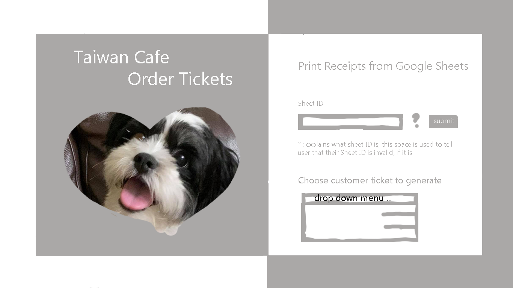
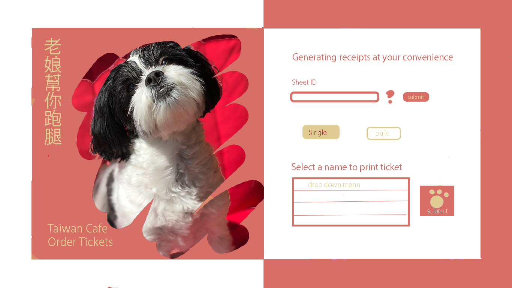
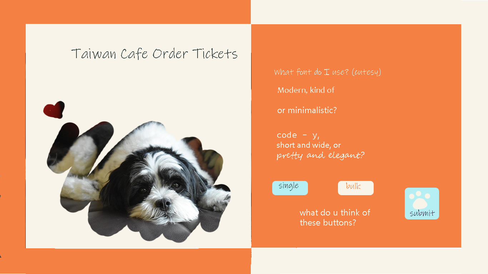
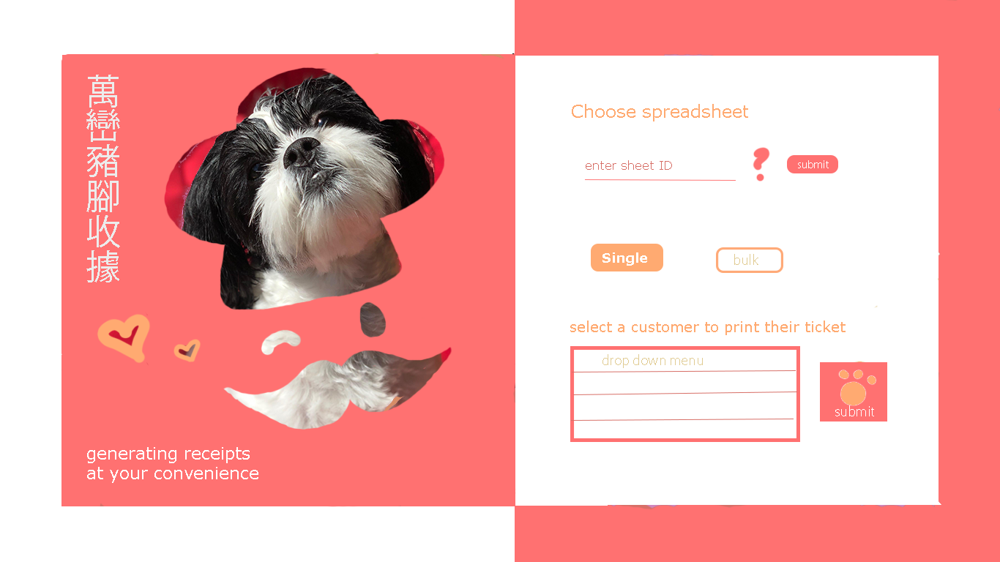

# Regarding these mockups

This project was the first time I attempted any form of digital design, so I'm a little shy about sharing these mockups LOL

## My progress

When I attempted my first mock-up, I didn't even know how to use the **Rectangle Tool** in Photoshop yet (press "U" LOL). So, my lines were hella furry because I was using the rectangle select tool to draw within the lines. Witness some furry gray lines below haha

I was super proud of myself for figuring out masking and erasing the mask with a shape. This resolved an issue that likely many people using pictures taken at home have to deal with: messy or distracting backgrounds. With the mask, only Chloe's cute little face was visible!

I thought my first theme was a little plain, as I tried to go with monochrome at first since I didn't trust myself with colors. So, I tried red and yellow! Chloe was super sassy in this pic, so I tried to come up with a sassy caption in Chinese. I also kinda dig the vertical text, so I'm going to keep channeling my weak bilingual language skills.

Next, I wanted to try a color scheme that was more similar to the restaurant. I couldn't fully commit to it, since I (personally) dislike bright orange ;-; It looks subjectively too strong for my eyes LOL, so for experimentation, I tried light blue because orange and blue are complimentary colors. Perhaps I subjectively had to add my favorite color into the mix to balance my disdain for my least favorite color.

Also, if anyone is reading this, which font would be most suitable for the purpose of this app? I tend to lean towards cutesy fonts because that's my preference. However, since it might be Kevin-susu or Stephanie using this to make receipts for their Google Form orders, their preferences might be different from mine. The fonts really do change the entire vibe of the page, haha.

By now, I realized that I could use color palettes. Why didn't I think of it earlier?? LOL

I picked a [palette] that looked cute, warm, and relatively similar to the restaurant's color scheme! I also took Valerie's friend's design suggestions into consideration and used a rounder, shorter font for readability and cuteness. Still haven't decided that this is the vibe I'm going for. Kaelynn also recommended that I draw a chef hat for the mask, since they're a restaurant, and I absolutely loved the idea, hehe.

Personally, this one is my favorite, but that's because I spent the longest and had Kaelynn's input. I think using someone's color palette reallyyy makes a difference, so I think it'd be useful to go back and fix the colors in the others too (like that orange cream one LOL)

# Credits and Acknowledgements

## Half-screen design

My design capabilities are incapable of coming up with the cute half-color, half-white border design that I featured in these mock-ups. I mainly lifted this idea from Maria Kovganich's [credit card payment UI design](https://dribbble.com/shots/14487852-Daily-UI-002-Credit-Card-Checkout)

## Salmon-yellow Theme

For this mock-up, I used a [color palette](https://colorhunt.co/palette/201781) from ColorHunt.co. I wish I could name the designer since the colors are so cute!

## Kaelynn's Advice

I asked a cute, really busy, aspiring designer for her advice on how she designs her pieces. This was her extremely detailed response (:

### COLOR PALETTES

usually i first ask the person i'm working with if they have any particular colors they're already thinking about for a design and work with that. but if they don't, i kind of base if off of what the topic/theme is of the design. (ex. if it's related to swimming --> blues, greens, yellows). sometimes i even just think of some colors i think might work and try it out. it's a lot of experimentation!

here's a website i sometimes use if i'm having trouble with finding a color palette. but you don't have to feel obliged to follow it exactly cause sometimes colors look nice together even if they don't correspond on the color wheel 😃 you can always just throw a bunch of colors together and see what looks best. oh yes, another important thing is that even if some colors look good together as a palette, they might not depending on how you use it in your design. for example, pastel colors look really nice together. but let's say you use a pale blue for the banner background, and the text on top uses a pale purple, that might not look nice because it'll be very hard to read. so after you lay out your design and want to start figuring out the colors, you can go through and change the colors until there is a combination that works well.

https://color.adobe.com/create/color-wheel

also i took a look at your designs and i'm liking the ideas so far! i'm not sure how much you've worked on it so far but i have a few tips

### FONT

usually when i work on fonts, i try find ones that aren't too simple but aren't too fancy. to me, simple fonts are like "arial" or ones that you'd typically write assignments. to me it feels like it gives off a less professional vibe? or it's not as developed in terms of design if that makes sense. it also feels lacking in terms of visuals. and then fancy fonts would be like really complex calligraphy (simple ones are ok though, just not ones like super swooshy swooshy 😂). those i tend to avoid because they can be hard to read and the goal of the design is to make sure people understand what it's trying to say. i think to sum it up, try to find a font that's unique but not too basic.

another factor for fonts is also the vibe your trying to go for. so designs that might want a more sleek, modern could choose a font like "raleway" or "montserrat". another example could be cutesy so those fonts could be " handlee" or "fredoka one". so if this is taiwan cafe, maybe you could go for a vibe that's modern but also comforting. all up to you! (also all these fonts are from google docs so you can check out how they look 🙂 )

### THEME

i think it's a really nice idea that you're using the owner's dog as the mascot cause it's like a nice personal touch 😃 a tip i have is maybe try and include some design aspect that signifies that it's a restaurant (since that's what this design is for). you want to make sure that when people see the design they can tell what it's for. i noticed how you kind of framed their dog with a heart shape (gray one) and paint strokes (red one), maybe you could try to do an outline of a chef's hat or some other food related item? another idea could even be utilizing the name of the restaurant, since it's called "taiwan cafe" you could maybe draw in the outline of a cafe or an iconic taiwan monument. and instead of using a photo of their dog, it might even be cute to draw a their a cartoony version of their dog wearing a chef's hat as a mascot, i think that could make it a lot more personalized and make it a recognizable icon.

i hope these tips help!! sorry if it's a lot HAHA i'm not a pro designer so don't feel pressured to listen to all the stuff i mentioned!! these are just things i picked up when i started getting into design for fun. i think the main thing i want to emphasize is to EXPERIMENT!!!! that's like 90% of the process. sometimes i go into a design thinking i already know how i want it to look and that i have all the ideas laid out, but by the end it looks super different. don't be afraid to just trying everything out, it's super fun too! and it's also a great idea to get other people to take a look at what you've made. sometimes it's hard to make changes after staring at a design for so long. also, don't worry if you can't get all of this stuff right away! takes a lot of practice/exposure but you'll get the hang of it in no time. anyway, i really hope this'll help get your creative juices flowing!! let me know if you have anymore questions or want more advice. would be glad to help 😄
